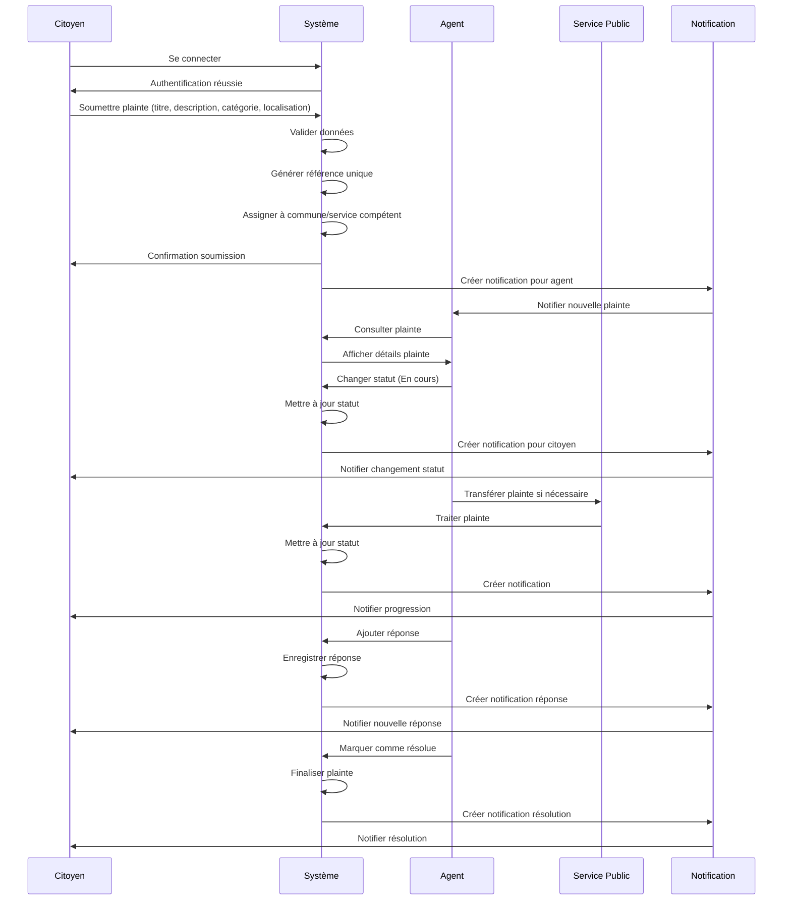
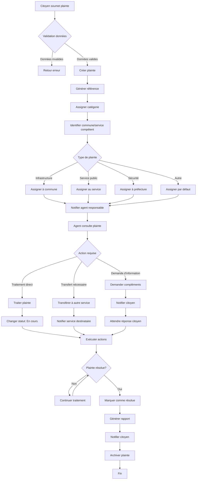
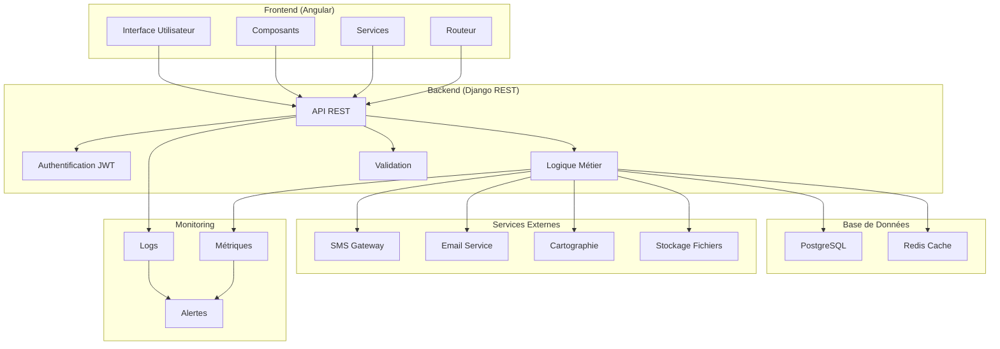
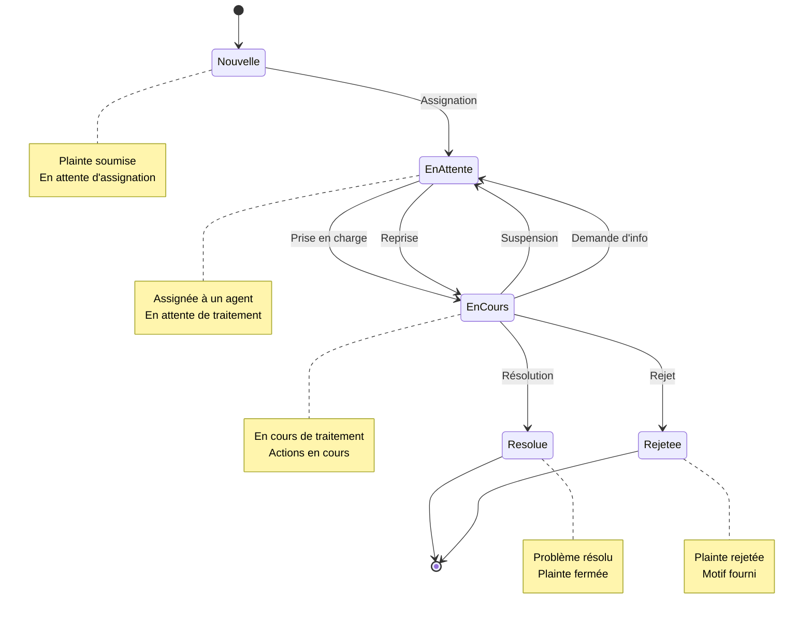
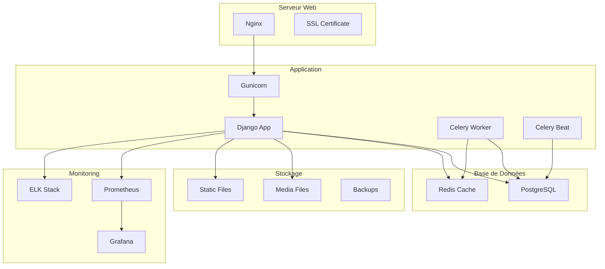
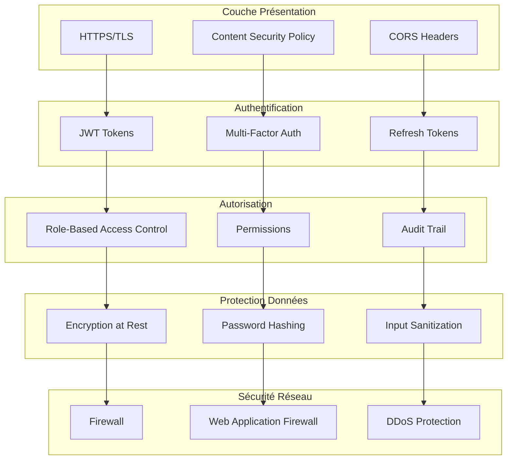
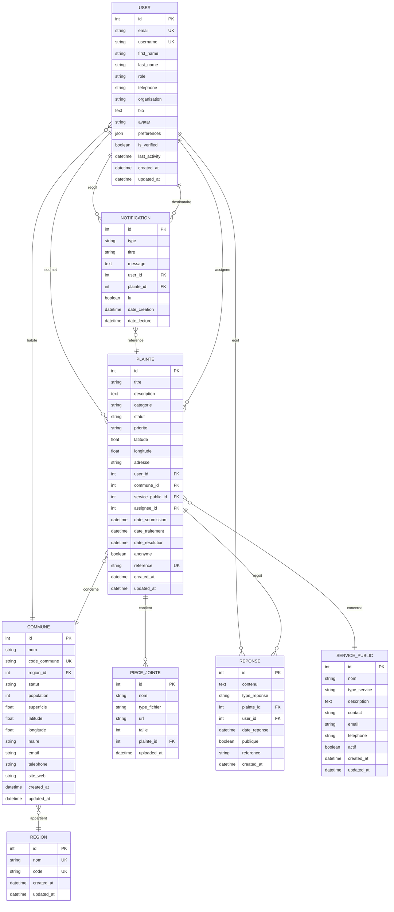
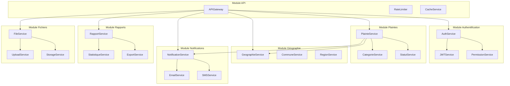

# Diagrammes UML - Plateforme de Gestion des Plaintes Citoyennes (Sénégal)

## 1. Diagramme de Classes

```mermaid
classDiagram
    class User {
        +String email
        +String username
        +String first_name
        +String last_name
        +String role
        +String telephone
        +String organisation
        +String bio
        +Image avatar
        +JSON preferences
        +Boolean is_verified
        +DateTime last_activity
        +DateTime created_at
        +DateTime updated_at
        +get_full_name()
        +nombre_analyses()
        +nombre_favoris()
    }

    class Region {
        +String nom
        +String code
        +DateTime created_at
        +DateTime updated_at
    }

    class Commune {
        +String nom
        +String code_commune
        +String statut
        +Integer population
        +Float superficie
        +Float latitude
        +Float longitude
        +String maire
        +String email
        +String telephone
        +URL site_web
        +DateTime created_at
        +DateTime updated_at
        +budget_total_actuel()
        +autonomie_financiere()
    }

    class Plainte {
        +String titre
        +Text description
        +String categorie
        +String statut
        +String priorite
        +Float latitude
        +Float longitude
        +String adresse
        +DateTime date_soumission
        +DateTime date_traitement
        +DateTime date_resolution
        +Boolean anonyme
        +String reference
        +get_duree_traitement()
        +get_statut_display()
    }

    class PieceJointe {
        +String nom
        +String type_fichier
        +String url
        +Integer taille
        +DateTime uploaded_at
    }

    class Reponse {
        +Text contenu
        +String type_reponse
        +DateTime date_reponse
        +Boolean publique
        +String reference
    }

    class Notification {
        +String type
        +String titre
        +Text message
        +Boolean lu
        +DateTime date_creation
        +DateTime date_lecture
    }

    class Statistique {
        +String type
        +String periode
        +JSON donnees
        +DateTime date_generation
    }

    class UserActivity {
        +String action
        +String description
        +JSON metadata
        +String ip_address
        +Text user_agent
        +DateTime created_at
    }

    class ServicePublic {
        +String nom
        +String type_service
        +String description
        +String contact
        +String email
        +String telephone
        +Boolean actif
    }

    %% Relations
    User ||--o{ Plainte : soumet
    User ||--o{ Reponse : ecrit
    User ||--o{ Notification : reçoit
    User ||--o{ UserActivity : génère
    User }o--|| Commune : habite
    Commune }o--|| Region : appartient
    Plainte ||--o{ PieceJointe : contient
    Plainte ||--o{ Reponse : reçoit
    Plainte }o--|| Commune : concerne
    Plainte }o--|| ServicePublic : concerne
    Plainte }o--|| User : assignee
    Notification }o--|| User : destinataire
    Notification }o--|| Plainte : reference
```

## 2. Diagramme de Cas d'Utilisation

```mermaid
graph TB
    subgraph "Acteurs"
        C[Citoyen]
        A[Agent Administratif]
        M[Maire/Préfet]
        SP[Service Public]
        ONG[ONG/Acteur Développement]
        AD[Administrateur]
    end

    subgraph "Système de Gestion des Plaintes"
        UC1[Créer un compte]
        UC2[Soumettre une plainte]
        UC3[Suivre le traitement]
        UC4[Consulter l'historique]
        UC5[Recevoir notifications]
        UC6[Gérer les plaintes]
        UC7[Répondre aux plaintes]
        UC8[Générer rapports]
        UC9[Analyser statistiques]
        UC10[Gérer utilisateurs]
        UC11[Configurer système]
    end

    %% Relations Citoyen
    C --> UC1
    C --> UC2
    C --> UC3
    C --> UC4
    C --> UC5

    %% Relations Agent Administratif
    A --> UC6
    A --> UC7
    A --> UC8

    %% Relations Maire/Préfet
    M --> UC6
    M --> UC7
    M --> UC8
    M --> UC9

    %% Relations Service Public
    SP --> UC6
    SP --> UC7
    SP --> UC8

    %% Relations ONG
    ONG --> UC9

    %% Relations Administrateur
    AD --> UC10
    AD --> UC11
    AD --> UC9
```



## 3. Diagramme de Séquence - Soumission et Traitement d'une Plainte



## 4. Diagramme d'Activité - Workflow de Gestion des Plaintes



## 5. Diagramme d'Architecture Système



## 6. Diagramme d'État - Cycle de Vie d'une Plainte



## 7. Diagramme de Déploiement



## 8. Diagramme de Sécurité



## 9. Diagramme de Données - Modèle Conceptuel



## 10. Diagramme de Composants



Ces diagrammes UML fournissent une vue complète de l'architecture et du fonctionnement de la plateforme de gestion des plaintes citoyennes pour le Sénégal, couvrant tous les aspects techniques, fonctionnels et organisationnels mentionnés dans le document de conception. 
